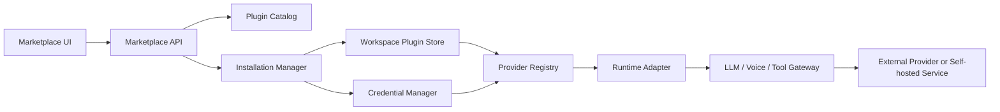

# FlowGram 插件市场需求与方案草案

调研日期：2026-06-06

## 1. 背景

FlowGram 当前是一个以工作流画布、节点引擎、运行时和前端插件为核心的 Rush monorepo。我们希望在 FlowGram 上建立一个更大的插件市场，让用户不仅能安装大模型供应商，也能安装语音能力、工具连接器、MCP 服务、节点插件、工作流模板和运行时扩展。

本方案参考了本地部署的 Dify 项目，尤其是 Dify 的模型供应商页面、插件安装流程、插件 manifest、marketplace 元数据和 provider credential schema。同时也检索了 GitHub 上适合借鉴或二次开发的开源项目。

## 2. 核心需求

### 2.1 产品目标

建立一个 FlowGram 插件市场，用来承载更多类型的内容。

第一批重点内容包括：

- 大模型供应商插件：OpenAI、Anthropic、DeepSeek、Ollama、OpenRouter、通义、火山方舟等。
- 语音插件：TTS、STT、ASR、声音克隆、语音理解。
- 工具插件：搜索、爬虫、数据库、CRM、协作软件、支付、知识库连接器。
- MCP 插件：可安装或配置的 MCP Server。
- 节点插件：在 FlowGram 画布里增加新的节点类型、节点表单和执行器。
- 工作流模板：可直接导入的 workflow、agent、chatflow。
- 运行时扩展：模型网关、代码沙箱、日志、评测、guardrail、成本统计。
- UI/物料插件：节点样式、主题、调试面板、监控看板。

### 2.2 第一阶段目标

第一阶段不建议直接做完整的通用插件运行沙箱，而是先做轻量市场内核：

1. 建立插件 manifest 协议。
2. 建立插件列表、搜索、分类、安装、启用、禁用、卸载流程。
3. 建立工作区级安装状态和凭据配置。
4. 优先支持模型供应商和语音供应商。
5. 允许从官方市场、GitHub、npm 或本地包导入插件。
6. 运行时先通过 adapter 调用，不执行任意第三方代码。

## 3. 从 Dify 借鉴什么

Dify 的主仓库许可证是修改版 Apache-2.0，包含多租户、前端品牌等额外限制。因此建议只借鉴设计，不直接复制主仓库代码。

更适合参考的是 Dify 的官方插件仓库和插件 SDK：

- [langgenius/dify-official-plugins](https://github.com/langgenius/dify-official-plugins)：Apache-2.0。包含大量模型供应商插件 manifest 和实现。
- [langgenius/dify-plugin-daemon](https://github.com/langgenius/dify-plugin-daemon)：Apache-2.0。可参考后续插件沙箱和安装任务架构。
- [langgenius/dify-plugin-sdks](https://github.com/langgenius/dify-plugin-sdks)：Apache-2.0。可参考插件 SDK 契约。

从 Dify 可以借鉴的关键设计：

- 插件市场元数据和实际安装状态分离。
- 插件以 manifest 声明能力、图标、作者、版本、模型类型、凭据表单和运行入口。
- 安装流程拆成下载、解码、校验、安装、任务状态轮询。
- 模型供应商通过 provider credential schema 生成配置表单。
- workflow 中引用 provider 和 credential reference，不保存明文 API Key。
- 插件来源区分 marketplace、GitHub、本地 package。

## 4. 开源项目调研结论

以下许可证判断只作为工程风险提示，不构成法律意见。正式商用、闭源分发或 SaaS 托管前应让法务复核。

### 4.1 插件市场和插件生态参考

| 项目 | 许可证 | 适合程度 | 建议 |
| --- | --- | --- | --- |
| [Dify Official Plugins](https://github.com/langgenius/dify-official-plugins) | Apache-2.0 | 高 | 适合借鉴或 fork，用来参考模型供应商和语音供应商 manifest |
| [Composio](https://github.com/ComposioHQ/composio) | MIT | 高 | 适合参考工具集成、认证、agent toolkit 和连接器生态 |
| [Langflow](https://github.com/langflow-ai/langflow) | MIT | 高 | 适合参考 workflow 模板、组件生态和 agent flow 体验 |
| [Node-RED](https://github.com/node-red/node-red) | Apache-2.0 | 中高 | 适合参考节点生态、flow 模板、低代码扩展方式 |
| [Backstage](https://github.com/backstage/backstage) | Apache-2.0 | 中 | 适合参考大型插件治理、权限和目录系统 |
| [OpenVSX](https://github.com/eclipse-openvsx/openvsx) | EPL-2.0 | 中 | 适合参考插件注册中心和发布协议，直接复制需注意 EPL 文件级义务 |
| [Flowise](https://github.com/FlowiseAI/Flowise) | Apache-2.0，企业目录单独许可 | 中 | 可参考 AI flow 组件，但企业部分不要使用 |
| [n8n](https://github.com/n8n-io/n8n) | Sustainable Use License | 低 | 不建议二开商用，只参考产品思路 |

### 4.2 模型网关和供应商聚合

| 项目 | 许可证 | 建议 |
| --- | --- | --- |
| [LiteLLM](https://github.com/BerriAI/litellm) | 主体 MIT，enterprise 目录单独许可 | 适合作为模型网关接入，减少 FlowGram 自己维护 provider adapter 的成本 |
| [Portkey Gateway](https://github.com/Portkey-AI/gateway) | MIT | 适合参考 AI Gateway、路由、guardrail、成本统计 |
| [One API](https://github.com/songquanpeng/one-api) | MIT | 适合国内模型统一 API、key 管理、私有化部署参考 |

### 4.3 语音能力候选

适合商用二开或服务接入的候选：

| 项目 | 许可证 | 能力 | 建议 |
| --- | --- | --- | --- |
| [openai/whisper](https://github.com/openai/whisper) | MIT | ASR | 可作为语音识别插件基础 |
| [whisper.cpp](https://github.com/ggerganov/whisper.cpp) | MIT | 本地 ASR | 适合自托管、本地推理、轻量部署 |
| [faster-whisper](https://github.com/SYSTRAN/faster-whisper) | MIT | 高性能 ASR | 适合服务化部署 |
| [FunASR](https://github.com/modelscope/FunASR) | MIT | ASR、说话人、情绪等 | 适合中文和工业级语音识别场景 |
| [PaddleSpeech](https://github.com/PaddlePaddle/PaddleSpeech) | Apache-2.0 | TTS、ASR、语音工具箱 | 可作为综合语音插件参考 |
| [Kokoro-FastAPI](https://github.com/remsky/Kokoro-FastAPI) | Apache-2.0 | TTS API 服务 | 可参考 TTS 服务封装，模型权重许可证需单独核验 |
| [OpenVoice](https://github.com/myshell-ai/OpenVoice) | MIT | 声音克隆 | 可做语音克隆插件，但必须增加用户授权和滥用防护 |
| [GPT-SoVITS](https://github.com/RVC-Boss/GPT-SoVITS) | MIT | 少样本声音克隆和 TTS | 可参考，商用前需核验模型、训练数据和滥用风险 |

不建议直接商用二开的候选：

| 项目 | 原因 | 建议 |
| --- | --- | --- |
| [Fish Speech](https://github.com/fishaudio/fish-speech) | 仓库许可证要求商业使用单独授权 | 可以做 Fish Audio API provider 插件，不建议直接 fork 自托管引擎商用 |

## 5. 插件类型设计

建议将 FlowGram 插件统一成多个 `kind`：

```ts
type PluginKind =
  | 'model-provider'
  | 'voice-provider'
  | 'tool'
  | 'mcp-server'
  | 'node'
  | 'workflow-template'
  | 'runtime-extension'
  | 'ui-material';
```

各类型说明：

| 类型 | 内容 | 第一阶段建议 |
| --- | --- | --- |
| `model-provider` | LLM、Embedding、Rerank、Vision、Moderation | 第一优先级 |
| `voice-provider` | TTS、STT、ASR、声音克隆 | 第一优先级 |
| `tool` | API 工具、SaaS 连接器、数据库、搜索 | 第一阶段做声明和配置，执行先走后端 adapter |
| `mcp-server` | MCP Server 配置和安装入口 | 第一阶段可做配置型插件 |
| `node` | 新节点类型、表单、执行器 | 第二阶段做，需要更严格沙箱和版本治理 |
| `workflow-template` | 可导入工作流模板 | 第一阶段可快速丰富市场内容 |
| `runtime-extension` | 网关、沙箱、评测、日志 | 第二阶段做 |
| `ui-material` | 主题、节点样式、面板 | 第二阶段做 |

## 6. 插件 manifest 草案

```yaml
schema_version: 0.1.0
id: langgenius/openai
kind: model-provider
version: 0.1.0
author: langgenius
label:
  zh_Hans: OpenAI
  en_US: OpenAI
description:
  zh_Hans: OpenAI 提供的大模型服务。
  en_US: Models provided by OpenAI.
icon: ./assets/openai.svg
license: Apache-2.0
source:
  type: github
  url: https://github.com/langgenius/dify-official-plugins
capabilities:
  - llm
  - text-embedding
  - speech2text
  - tts
permissions:
  network:
    outbound:
      - https://api.openai.com
credential_schema:
  - variable: api_key
    label:
      zh_Hans: API Key
      en_US: API Key
    type: secret-input
    required: true
  - variable: api_base
    label:
      zh_Hans: API Base
      en_US: API Base
    type: text-input
    required: false
    default: https://api.openai.com/v1
models:
  llm:
    predefined:
      - gpt-4o
      - gpt-4o-mini
runtime:
  type: openai-compatible
  adapter: '@flowgram.ai/model-provider-openai-compatible'
```

## 7. 总体架构



### 7.1 Marketplace UI

提供插件市场页面：

- 插件分类和搜索。
- 插件详情页。
- 安装、卸载、启用、禁用。
- 版本和更新提示。
- 凭据配置状态。
- 官方、合作方、社区标识。
- 权限展示，例如网络访问、密钥、文件、节点执行器。

### 7.2 Plugin Catalog

保存市场元数据：

- 插件 id、名称、作者、描述、图标。
- kind、capabilities、tags。
- 最新版本、历史版本。
- 下载地址、checksum、签名信息。
- 许可证、来源、审核状态。
- 安装量、评分、更新时间。

### 7.3 Installation Manager

负责工作区级安装状态：

- `not_installed`
- `installed`
- `configured`
- `disabled`
- `needs_update`
- `failed`

第一阶段安装可以只是写入安装记录和解析 manifest，不执行第三方代码。

### 7.4 Credential Manager

管理 API Key、OAuth token、baseURL、私有服务地址等敏感配置。

要求：

- workflow JSON 中只保存 `providerId`、`modelId`、`credentialRef`。
- 明文密钥只保存在服务端加密存储。
- 支持测试连接。
- 支持多套凭据和默认凭据。
- 支持工作区级权限。

### 7.5 Provider Registry

运行时通过 registry 找到 provider adapter。

示例：

- `openai-compatible`
- `anthropic`
- `gemini`
- `ollama`
- `whisper`
- `funasr`
- `kokoro`
- `mcp-server`

### 7.6 Runtime Adapter

adapter 负责把 FlowGram 的标准请求转成具体 provider 请求。

第一阶段建议：

- 模型供应商优先走 OpenAI-compatible 协议。
- 可接 LiteLLM、One API、Portkey 这类网关，减少重复适配。
- 语音供应商做 `speech2text`、`text2speech`、`voice-clone` 三种标准接口。
- 工具插件先做后端 adapter，避免在浏览器执行第三方代码。

## 8. 与 FlowGram 当前项目的结合

建议新增偏业务层的包，不污染 canvas core：

| 包 | 职责 |
| --- | --- |
| `packages/marketplace/plugin-interface` | 插件 manifest 类型、Zod 校验、能力枚举 |
| `packages/marketplace/plugin-registry` | 插件目录、安装态、查询、版本比较 |
| `packages/runtime/model-provider` | 模型 provider adapter 接口 |
| `packages/runtime/voice-provider` | 语音 provider adapter 接口 |
| `packages/plugins/model-provider-plugin` | 编辑器侧模型供应商面板和模型选择器 |
| `packages/plugins/plugin-marketplace-plugin` | 插件市场 UI 入口和面板 |
| `apps/demo-plugin-marketplace` | 第一阶段演示应用 |

当前 FlowGram 的 LLM executor 还比较接近直连 OpenAI。后续建议把 LLM 节点中的 `apiKey`、`apiHost`、`modelName` 改成：

```ts
interface LLMNodeProviderConfig {
  providerId: string;
  modelId: string;
  credentialRef: string;
  parameters?: Record<string, unknown>;
}
```

## 9. 分期路线

### 9.1 P0：方案和协议

- 定义插件 manifest。
- 定义插件 kind、capability、permission。
- 定义 provider adapter 标准接口。
- 明确许可证和安全策略。

### 9.2 P1：模型供应商和语音供应商市场

- 做模型供应商列表和安装配置页。
- 从 Dify Official Plugins 转换一批 provider manifest。
- 支持 OpenAI-compatible、Ollama、Anthropic、Gemini、DeepSeek。
- 支持 Whisper、FunASR、Kokoro、OpenVoice 等语音插件。
- 支持凭据加密、测试连接、默认 provider。

### 9.3 P2：工具和 MCP 插件

- 支持工具插件 manifest。
- 支持 MCP Server 配置、启动方式、权限展示。
- 支持工具执行日志和错误展示。
- 参考 Composio 做认证和连接器体验。

### 9.4 P3：节点插件和运行时扩展

- 支持新增节点类型。
- 支持节点表单和 UI 物料。
- 支持运行时 executor 注册。
- 引入签名、审核、沙箱、资源限制。

### 9.5 P4：完整市场治理

- 插件发布后台。
- 版本审核。
- 官方、合作方、社区分级。
- 评分、安装量、评论。
- 自动升级和回滚。
- 安全扫描和许可证扫描。

## 10. 安全与合规风险

### 10.1 许可证风险

- Dify 主仓库、LobeHub、Open WebUI、n8n 等项目不能简单当作宽松开源复制。
- Fish Speech 等模型项目可能只允许研究和非商业用途。
- 语音模型还要额外核验模型权重、训练数据和声音授权。
- 插件市场需要展示许可证和风险提示。

### 10.2 密钥风险

- 不允许在 workflow JSON、浏览器 localStorage、日志中泄露 API Key。
- 插件不能直接读取所有 provider 密钥。
- 凭据应按工作区、插件、能力分级授权。

### 10.3 第三方代码执行风险

- 第一阶段不执行任意第三方代码。
- 后续 node 插件和 runtime extension 必须有沙箱。
- 要限制网络、文件、环境变量、内存、CPU 和执行时间。

### 10.4 语音滥用风险

声音克隆和语音合成需要额外限制：

- 用户必须确认拥有声音授权。
- 对声音克隆插件加风险提示。
- 可考虑水印、审计日志、调用限额。
- 禁止默认公开敏感声音模型。

## 11. 给评审老师的讨论问题

1. FlowGram 插件市场第一阶段是否应聚焦模型和语音，还是同步做工具和 MCP？
2. 插件 manifest 是否应该兼容 Dify manifest，还是只做转换器？
3. 模型 provider 是否优先接 LiteLLM/One API/Portkey 这类网关？
4. 节点插件何时开放第三方执行器？是否必须等沙箱完成？
5. 官方、合作方、社区插件如何审核和分级？
6. 声音克隆是否允许进入第一阶段？如果允许，合规策略如何定？
7. 插件市场是先做本地私有市场，还是直接设计云端发布平台？

## 12. 当前建议

建议路线：

1. 不直接二开 Dify 主仓库。
2. 借鉴 Dify 的插件 manifest、模型供应商 schema、安装态和 marketplace 流程。
3. 优先复用 Apache-2.0 或 MIT 项目，例如 Dify Official Plugins、Composio、Langflow、Node-RED、Whisper、FunASR、PaddleSpeech。
4. 第一阶段做大市场框架，但内容聚焦模型供应商、语音供应商、工具配置和工作流模板。
5. 插件执行能力分阶段开放，先做声明式和 adapter，后做沙箱运行。

这样可以尽快让 FlowGram 插件市场有内容、有入口、有安装配置流程，同时避免一开始就陷入复杂的通用插件运行时和安全治理。
